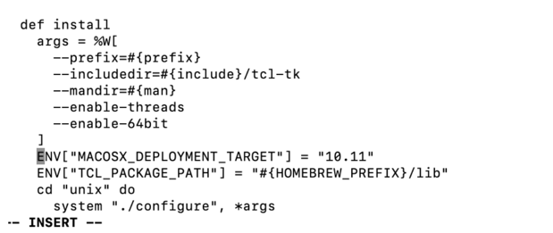

# Instructions

## Linux Setup
Assumptions:

* You have installed X-Plane 11.50+
* You have a reasonably fast CPU and broadband internet 
* FUSE is installed and setup (Enable `user_allow_other` in /etc/fuse.conf, if not already the case.) 

### Steps:

1. Download the most recent packaged release (autortho_lin_####.bin) [from here](https://github.com/kubilus1/autoortho/releases/latest)
3. Make executable if needed `chmod +x autoortho_lin.bin` 
4. Run the program `./autoortho_lin.bin`
5. Configure your settings and paths for your system 
6. Download and setup an ortho set from the 'Scenery' tab.
7. Click 'Run' to run the program
8. Configure your scenery_packs.ini file appropriately
9. Run X-Plane and choose a location for an ortho set you have downloaded

## Windows Setup

Assumptions:

* You are running 64bit Windows 10+
* You have install X-Plane 11.50+
* You have setup and configured either: [Dokan](https://github.com/dokan-dev/dokany/releases/latest) or [WinFSP](https://github.com/winfsp/winfsp)
* * If you have trouble with one, try the other! 
    Some users on Windows 11 have better luck
    with WinFSP for some reason.  *Windows users should always attempt both before asking questions on forums!!!* 
* * If both Dokan and WinFSP are installed, Dokan will be preferred. 
    Users can force preferring WinFSP by setting prefer_winfsp=True in their config file.
* You install all components, including scenery, on a local NTFS drive.

### Zip File Steps:

1. Download the most recent packaged release (autoortho_win_####.zip) [from here](https://github.com/kubilus1/autoortho/releases/latest)
2. Extract the downloaded directory.
4. Run `autoortho_win.exe` from within the extracted dir.
5. Configure your settings and paths for your system 
6. Download and setup an ortho set from the 'Scenery' tab.
7. Click 'Run' to run the program
8. Configure your scenery_packs.ini file appropriately 
9. Run X-Plane and choose a location for an ortho set you have downloaded

### Experimental Installer Steps:

Alternatively, there is now an installer that can be used.  This is
experimental ATM:

1. Download the most recent packaged release (AutoOrtho_####.exe) [from here](https://github.com/kubilus1/autoortho/releases/latest)
2. Run the program.
3. If there is a prior install you will be prompted to uninstall first.  Do
   this.
4. Run AutoOrtho from your system start menu.
5. Configure your settings and paths for your system 
6. Download and setup an ortho set from the 'Scenery' tab.
7. Click 'Run' to run the program
8. Configure your scenery_packs.ini file appropriately 
9. Run X-Plane and choose a location for an ortho set you have downloaded


## MacOS Setup

All of below steps require running command in ``Ternimal`` app.

1. Install [Homebrew](https://brew.sh/) if you don't have it yet.
2. Install [FUSE for macOS](  ://osxfuse.github.io/) with command ``brew install --cask macfuse``.
> Note: You need to enable FUSE in ``System Preferences`` -> ``Security & Privacy`` -> ``General`` -> ``Allow apps downloaded from:`` -> ``App Store and identified developers``. Watch some youtobe videos if you don't know how to do it.
    
3. Install [xcode command line tools](https://developer.apple.com/xcode/resources/) with command ``xcode-select --install``.
> Note: if you have already installed xcode, you can skip this step. but make sure it is up-to-date.
4. Clone the code
```shell
git clone https://github.com/zodiac1214/autoortho.git

cd autoortho && git checkout macos-0.7.2
```
5. install python3.10 with command ``brew install python@3.10``.
6. install jpeg-turbo with command ``brew install jpeg-turbo``.
7. brew install tcl-tk with command ``brew install tcl-tk``.
8. Run command `brew tap --force homebrew/core`.
9. modify brew tcl-tk
```
brew edit tcl-tk
```
Us your arrow keys to go down to
```
def install
args = %W[
--prefix=#{prefix}
--includedir=#{include}/tcl-tk
--mandir=#{man}
--enable-threads
--enable-64bit
]
```
Then press “i”

Then paste this line in that space

`ENV["MACOSX_DEPLOYMENT_TARGET"] = "10.11"`

Make sure it is aligned with the line after it.

It should look like this after


After this hit ESC on your keyboard then type the following:

`:wq!` (including the colon)

Then hit enter

10. reinstall tcl-tk with modified brew tcl-tk
```shell
HOMEBREW_NO_INSTALL_FROM_API=1 brew reinstall --build-from-source tcl-tk
```
11. install python-tk with command ``brew install python-tk@3.10``.
12. install python dependencies.
```
python3.10 -m pip install -U pip
python3.10 -m pip install setuptools
python3.10 -m pip install wheel
python3.10 -m pip install -r requirements-build.txt --no-use-pep517
python3.10 -m pip install -r requirements.txt
```
13. Remove any MacOS quarantine flags
``` shell
sudo xattr -dr com.apple.quarantine *
```
14. Run it
``` shell
python3.10 autoortho
```
---

## Requirements and Compatibility

To run from source, this project requires python3.x and all pre-requisites in the
`requirements.txt` file.  Also, a copy of X-Plane 11.50+ of course.

Most testing is done on Ubuntu 22.04 using FUSE.  Other Linux flavors ought to work as
well.  MacOS very likely *should* work, but I have no way of testing it.

I have done testing on Windows 10 with the
[Dokan](https://github.com/dokan-dev/dokany/releases/latest) project.
This does appear to work fine, but this is not how I use this project, so it's not my primary concern.

## Known issues and limits
* Currently I try to limit the memory usage, though it's possible it
  will exceed this in certain scenarios.
* Not really possible to post-process the satellite photos.  You get what you
  get.
* Will add a couple minutes to initial flight time for new areas.  That's to
  be expected though.
* Will require and use a lot of internet requests (surprise!) and writes a lot of small files locally.  
  There are many parts along your path that may need tuning or may not like this (ISP, DNS, Wifi, drive speed, CPU speed, etc).  
  User's should be ready to diagnose their specific setup and determine if this project fits withing their own personal computing requirements.
* Windows has too many variations with how filesystems are handled, links are
  done, intrusive malware detection systems, etc and will likely always be
  slower and more difficult to use with this project.

## TODOS

* ~See if this will work on Windows with WinFSP~ 
* ~Allow for overriding the satellite source type.  Since this pulls on the fly, we aren't stuck with what was setup initially with Ortho4XP.~
* ~Package a set of DSF files to get started with~
* Attempt to make a workable OSX version

## Warnings, Warranty, etc

This project is provided free of charge and is not warrantied in any way.  Use
at your own risk.

Accessing map data from 3rd parties may or may not be allowed and is up to you
the end user to determine and use appropriately.
